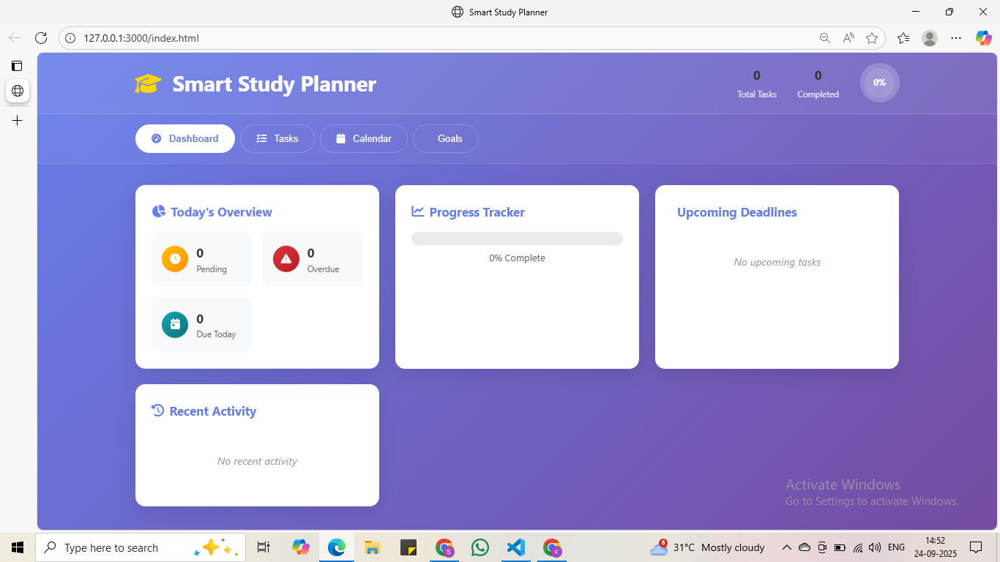
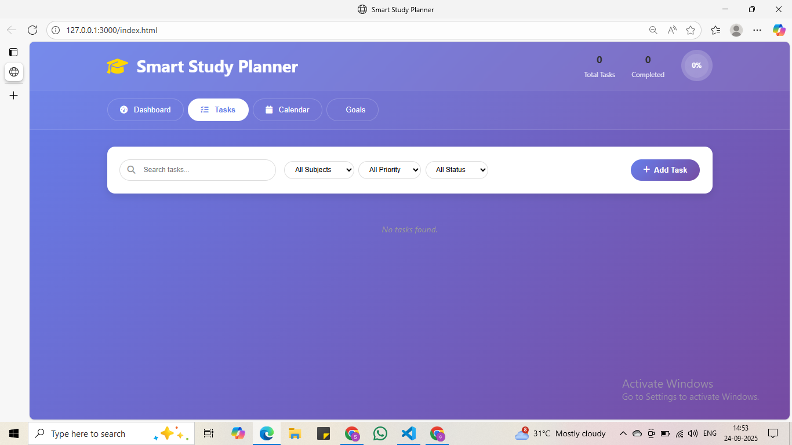
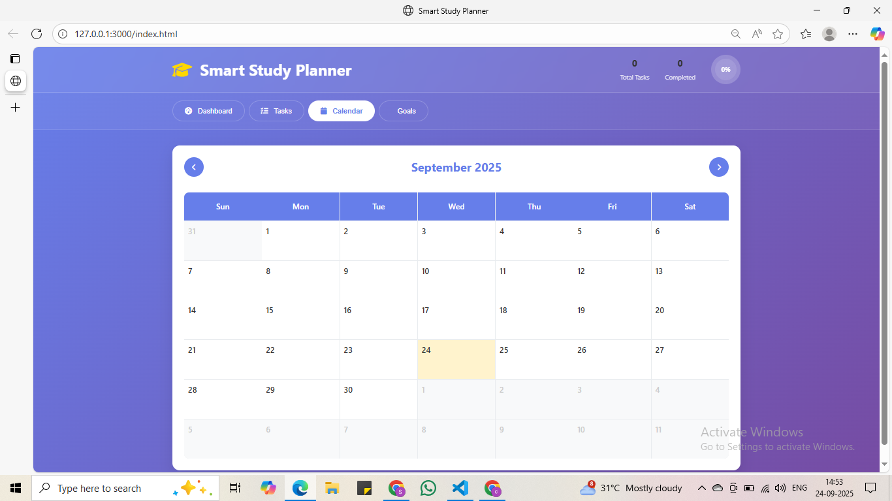
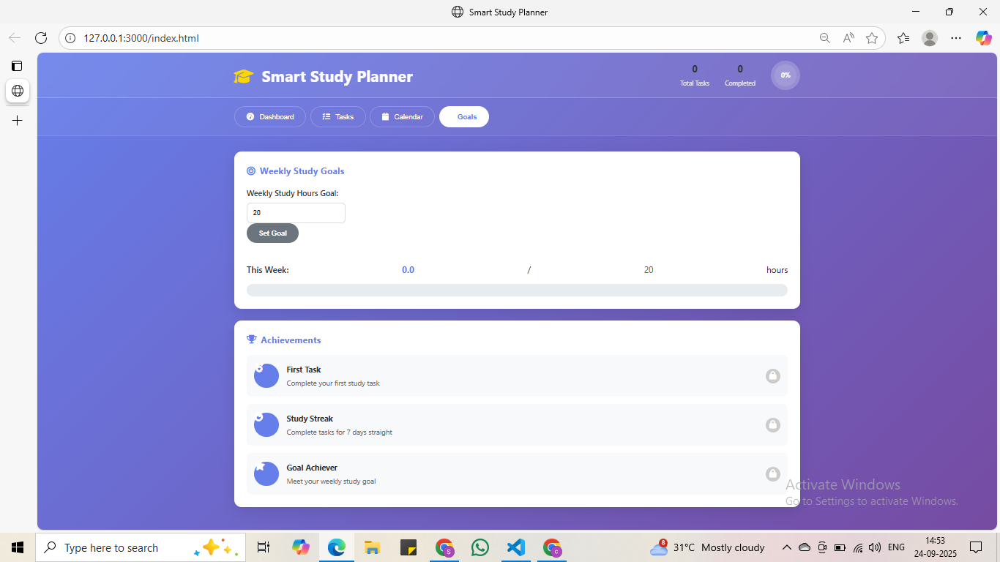

# 📚 Smart Study Planner

A comprehensive web-based study planner designed to help students organize their academic tasks, track progress, and achieve their study goals. Built with vanilla HTML, CSS, and JavaScript for optimal performance and offline functionality.


## 🎯 Problem Statement

Students often face challenges in organizing study schedules and tracking academic tasks effectively. Traditional paper-based planners are easily lost and lack interactive features, while existing digital solutions are often complex, expensive, or require constant internet connectivity. This Smart Study Planner addresses these issues by providing a simple, offline-capable solution for academic productivity.

## ✨ Features

### Core Features
- **📝 Complete Task Management (CRUD)**: Create, read, update, and delete study tasks
- **💾 Local Storage Integration**: All data persists locally - no internet required
- **📊 Visual Progress Tracking**: Real-time progress bars and completion percentages
- **⏰ Smart Reminders**: Highlight overdue tasks and upcoming deadlines
- **🔍 Advanced Filtering**: Filter by subject, priority, status, and search functionality

### Enhanced Features
- **📅 Calendar Integration**: Monthly calendar view with task visualization
- **🎯 Goal Setting**: Set and track weekly study hour goals
- **🏆 Achievement System**: Unlock badges for motivation and engagement
- **📱 Responsive Design**: Optimized for desktop, tablet, and mobile devices
- **🔔 Browser Notifications**: Optional reminder notifications
- **📈 Activity Tracking**: Monitor recent actions and study patterns

## 🚀 Demo

[Live Demo](https://your-username.github.io/smart-study-planner) *(Replace with your actual GitHub Pages URL)*

## 📸 Screenshots

### Dashboard View


### Task Management


### Calendar View


### Goals & Achievements


## 🛠️ Technologies Used

- **HTML5**: Semantic structure and accessibility
- **CSS3**: Modern styling with gradients, animations, and responsive design
- **JavaScript (ES6+)**: Dynamic functionality and local storage management
- **Font Awesome**: Icons and visual elements
- **Local Storage API**: Offline data persistence

## 📋 Installation & Setup

1. **Clone the repository**
   ```bash
   git clone https://github.com/SaiDeepthiCh-17/smart-study-planner.git
   cd smart-study-planner
   ```

2. **Install dependencies** (optional - for development server)
   ```bash
   npm install
   ```

3. **Run the application**
   
   **Option 1: Using npm (recommended)**
   ```bash
   npm start
   ```
   
   **Option 2: Direct file opening**
   - Simply open `index.html` in your web browser
   
   **Option 3: Using Python (if available)**
   ```bash
   python -m http.server 3000
   ```

4. **Access the application**
   - Open your browser and navigate to `http://localhost:3000`

## 📖 Usage Guide

### Getting Started
1. **Add Your First Task**: Click the "Add Task" button to create your first study task
2. **Set Task Details**: Fill in title, description, subject, priority, and due date
3. **Track Progress**: Mark tasks as complete to see your progress update in real-time
4. **Set Goals**: Navigate to the Goals tab to set weekly study hour targets

### Task Management
- **Create**: Use the "Add Task" button to create new tasks
- **Edit**: Click the "Edit" button on any task card to modify details
- **Complete**: Mark tasks as done using the "Complete" button
- **Delete**: Remove tasks using the "Delete" button
- **Filter**: Use the search bar and filter dropdowns to find specific tasks

### Calendar Features
- **Monthly View**: See all your tasks organized by due dates
- **Navigation**: Use arrow buttons to navigate between months
- **Task Indicators**: Days with tasks are highlighted for easy identification

### Goal Setting
- **Weekly Goals**: Set target study hours for each week
- **Progress Tracking**: Visual progress bar shows your advancement
- **Achievements**: Unlock badges for completing goals and maintaining streaks

## 🏗️ Project Structure

```
smart-study-planner/
├── index.html          # Main HTML file
├── styles.css          # CSS styles and responsive design
├── script.js           # JavaScript functionality
├── package.json        # Project dependencies and scripts
├── README.md           # Project documentation
└── screenshots/        # Application screenshots
    ├── dashboard.png
    ├── tasks.png
    ├── calendar.png
    └── goals.png
```

## 🎨 Design Features

- **Modern UI**: Clean, intuitive interface with glassmorphism effects
- **Color-Coded System**: Priority levels and task statuses with distinct colors
- **Smooth Animations**: Hover effects and transitions for better user experience
- **Mobile-First**: Responsive design that works on all screen sizes
- **Accessibility**: Semantic HTML and keyboard navigation support

## 🔧 Customization

### Adding New Subjects
Edit the subject options in both the task form and filter dropdown:
```javascript
// In script.js, modify the subjects array
const subjects = ['Mathematics', 'Science', 'History', 'Literature', 'Programming', 'Your-New-Subject'];
```

### Changing Color Themes
Modify the CSS custom properties in `styles.css`:
```css
:root {
  --primary-color: #667eea;
  --secondary-color: #764ba2;
  /* Add your custom colors */
}
```

## 🤝 Contributing

Contributions are welcome! Please feel free to submit a Pull Request. For major changes, please open an issue first to discuss what you would like to change.

### Development Setup
1. Fork the repository
2. Create your feature branch (`git checkout -b feature/AmazingFeature`)
3. Commit your changes (`git commit -m 'Add some AmazingFeature'`)
4. Push to the branch (`git push origin feature/AmazingFeature`)
5. Open a Pull Request

## 📝 License

This project is licensed under the MIT License - see the [LICENSE](LICENSE) file for details.

## 🙏 Acknowledgments

- **Font Awesome** for the beautiful icons
- **MDN Web Docs** for comprehensive web development documentation
- **CSS-Tricks** for modern CSS techniques and best practices
- **JavaScript.info** for advanced JavaScript concepts

## 🔮 Future Enhancements

- [ ] Cloud synchronization for cross-device access
- [ ] Collaborative study groups and shared tasks
- [ ] AI-powered task scheduling recommendations
- [ ] Integration with popular calendar applications
- [ ] Advanced analytics and productivity reports
- [ ] Pomodoro timer integration
- [ ] Export functionality (PDF, CSV)
- [ ] Dark mode theme option

---

⭐ **Star this repository if you found it helpful!** ⭐
